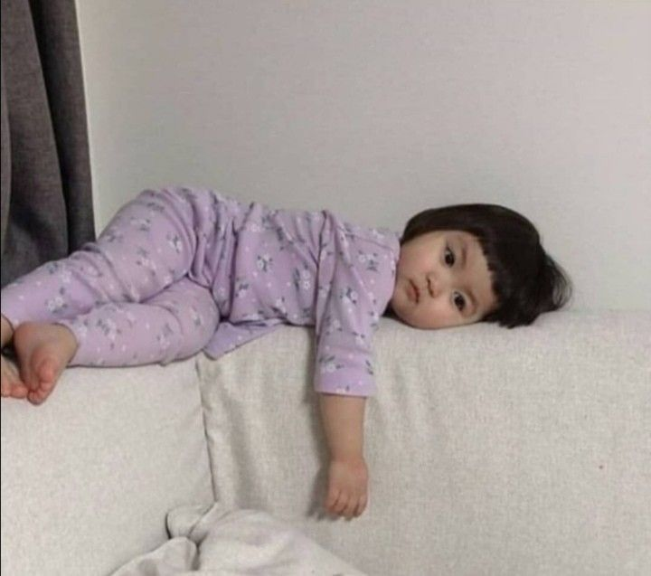

# Hi Peeps, I'm Rey!🙌😸

🙋‍♀️Greetings! I'm Reisya Junita, a mathematics graduate of Pamulang University. I have a strong interest in data, with a focus on machine learning and data science. I am presently attending the AI engineer intensive training provided by Lintasarta, the Laskar AI cohort👩‍💻💻. 

### - Learning :
- 🤖 Machine Learning
- 🧩Data Science 
### - Hobbies : 
- 🎮 Gaming Addict 
- 📖 Journaling
- 🛍️ Shopping
- 🚲 Road Biking

 
 
 

# Quotes Of The Day✨
  

# Github Statistic

# Contact Me :

For collaborations, discussions, or just to say hello, feel free to drop me a message!😉.

<a href="https://www.linkedin.com/in/reisyajunita/">
  
 
 
 
</a>

